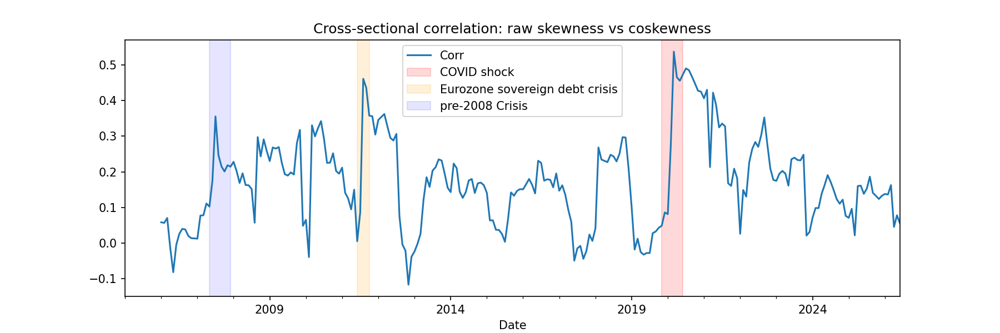
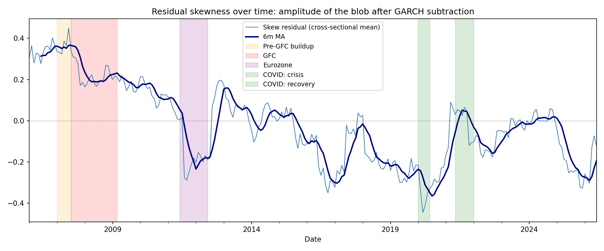

# Skewness as a Cross-Sectional Signal: Tree-Level vs Loop-Generated Non-Gaussianity

## 1. Motivation

Standard asset pricing models (CAPM, Fama-French, momentum, ...) describe returns primarily through their first two moments: mean and variance. This implicitly treats the return-generating process as approximately Gaussian. Empirically, returns are not Gaussian: they exhibit skewness, fat tails, and regime-dependent behavior.

This project does not ask the broad question "does skewness predict returns" that has already been studied extensively (Harvey & Siddique 2000; Bali, Cakici & Whitelaw 2011; Boyer, Mitton & Vorkink 2010) and is revisited here mainly as a starting point. The central question this project asks is narrower and more structural:

> **Is the non-Gaussianity observed in stock returns a genuine, fundamental feature of the return-generating process, or is it an emergent consequence of time-varying volatility, a phenomenon that requires no asymmetric mechanism at all to produce?**

### The field theory analogy (motivation only)

This question is naturally phrased using language borrowed from quantum field theory, where it serves only as motivating intuition, not as a methodological commitment. The methodology itself is standard econometrics throughout: GARCH modeling, Monte Carlo simulation, Fama-MacBeth regression. The table below records the analogy precisely so the borrowed language is never ambiguous.

| Field theory object | Financial analogue | Precise meaning here |
|---|---|---|
| Scalar field $\phi(x)$ | Return $r_{i,t}$ | The fundamental observable |
| Free / Gaussian theory | GARCH(1,1) with Gaussian innovations | A purely quadratic theory, all dynamics in the 2-point function |
| Time-varying mass $m^2(t)$ | Conditional variance $\sigma_t^2$ | Volatility clustering; the theory remains quadratic |
| 2-point function | Conditional variance structure | Fully captured by GARCH |
| 3-point function $\langle\phi\phi\phi\rangle_c$ | Skewness | The lowest-order observable sensitive to non-Gaussianity |
| Tree-level vertex | Genuine structural asymmetry | A hardwired cubic coupling e.g., asymmetric jump risk |
| Loop correction | GARCH-induced skewness | Nonzero 3-point function generated by the free theory alone, via time-varying variance |
| Dressed vertex / "the blob" | Realized skewness | The full observed 3-point amplitude |
| Subtraction scheme | Choice of GARCH specification | The free-theory benchmark used to define the residual; not unique |
| Anomaly cancellation | Net-zero residual despite real interactions | A zero residual does not imply no interactions, contributions could cancel |

We treat the market as a black box and ask a model-independent question about one observable: the 3-point function. We do not claim to know, and do not attempt to identify, the underlying mechanism generating any residual amplitude. We can only say whether a specific, computable null model (GARCH with Gaussian innovations) accounts for the observed amplitude, and we report what is left over under that one specific subtraction scheme.

## 2. Data

Daily returns for US equities from 2005 to the present, sourced via `yfinance`. Delisted stocks are explicitly retained in the universe to mitigate survivorship bias — a stock with returns up to its delisting date and no observations afterward is the correct representation; dropping it would systematically remove the worst outcomes from the sample.

**Data quality caveats.** `yfinance` data, particularly for delisted names, contains artifacts: a small number of extreme single-day or single-month returns (in some cases exceeding 1000% in magnitude) that are almost certainly errors rather than genuine price moves. These were addressed by:
- Dropping any ticker with fewer than 63 total trading-day observations
- Clipping monthly returns at ±40% per stock before any cross-sectional averaging
- A minimum-observation filter (200 of 252 days) on the rolling skewness and coskewness windows

These corrections were necessary and material. Early, uncorrected backtests produced impossible results (e.g., monthly long-short returns of -450%) entirely attributable to a handful of corrupted observations from delisted micro-cap names.

## 3. Part 1: Signal construction and the unconditional pricing test

### 3.1 Definitions

Raw skewness, rolling 252-trading-day window:

$$\text{Skew}_i = \frac{E[(r_i - \mu_i)^3]}{\sigma_i^3}$$

Coskewness, normalized (Harvey & Siddique 2000):

$$\kappa_i = \frac{E[(r_i - \mu_i)(r_m - \mu_m)^2]}{\sigma_i \cdot \sigma_m^2}$$

Both signals are winsorized at the 1st/99th percentile cross-sectionally and standardized (z-scored) at each month-end before use in portfolio formation and regression.

Idiosyncratic skewness (factor-residual asymmetry) was scoped out of this version of the project to keep the deliverable tractable; see Section 6.

### 3.2 Signal correlation as a stress indicator

Before testing predictive power, we examined the cross-sectional correlation between raw skewness and coskewness over time. The two signals are only weakly correlated on average (mean ≈ 0.16 across the full sample), indicating they capture largely distinct information. However, this correlation is highly time-varying, with three pronounced peaks:

- **July 2007** — the third highest correlation in the sample, preceding the acute phase of the financial crisis by over a year
- **July–October 2011** — the second highest correlation coinciding with the Eurozone sovereign debt crisis and the US debt ceiling crisis
- **Early 2020** — the highest correlation coinciding with the COVID shock

The correlation then **collapses sharply by July 2008**, during the most acute phase of the financial crisis, before gradually recovering.

This pattern is interpretable: in the run-up to a systemic event, the stocks identified as individually skewed (raw skewness) and the stocks identified as having poor tail co-movement with the market (coskewness) increasingly converge. During the acute crash itself, this coherence collapses: coskewness converges toward a common value across nearly all stocks (everything crashes with the market), while raw skewness becomes dominated by crisis-specific dynamics (forced selling, margin calls, short squeezes). The two measures decouple precisely when the cross-section is most distorted.

This suggests **the level of agreement between raw skewness and coskewness functions as a leading indicator of systemic stress, while its collapse marks the transition into acute crisis** — a result that, to our knowledge, is not a standard finding in the published literature and emerged directly from this analysis.

### 3.3 Portfolio tests and cross-sectional regression

Monthly rebalanced long-short portfolios (long the bottom quintile, short the top quintile by signal), holding for one month, with returns measured strictly out-of-sample relative to the signal formation date (no look-ahead).

| Metric | Raw skewness | Coskewness |
|---|---|---|
| Annualized return | -0.59% | +2.91% |
| Annualized volatility | 7.6% | 11.0% |
| Sharpe ratio | -0.08 | +0.26 |
| Max drawdown | -34.7% | -34.5% |
| Information Coefficient (mean) | -0.0063 | -0.0099 |
| IC t-statistic | -1.04 | -1.42 |
| Hit rate | 48.2% | 47.8% |
| Fama-MacBeth $\gamma$ | -0.00047 | -0.00074 |
| Fama-MacBeth t-statistic | -0.87 | -1.07 |

**Neither signal shows statistically significant cross-sectional predictive power.** The mild, consistently negative sign across both signals and all three measurement approaches (portfolio sorts, IC, Fama-MacBeth) is directionally consistent with the lottery-demand literature: investors overpay for positively skewed, lottery-like payoffs, compressing forward returns on high-skewness names. However, the effect is too weak and unstable here to be statistically distinguishable from zero.

### 3.4 Amplitude is not the same as pricing

A signal can have a large, highly significant amplitude as a statistical object while carrying no cross-sectional pricing information at all. We tested this directly: is the cross-sectional mean of realized skewness itself significantly different from zero, independent of whether it predicts returns?

| | Mean amplitude | t-statistic |
|---|---|---|
| Raw skewness | +0.180 | +16.6 |
| Coskewness | -0.115 | -7.96 |

Both are overwhelmingly significant. **The 3-point function is large and real. It is simply not priced.** This finding motivates Part 2: if the amplitude is real but unpriced, what is generating it, and can any part of that origin be ruled in or out?

## 4. Part 2: Decomposing the amplitude

### 4.1 The null model

We fit a GARCH(1,1) model with Gaussian innovations to each stock's daily return series. This is the financial analogue of a free theory with a time-varying mass term and no cubic vertex. Of 445 stocks with sufficient history, 305 produced numerically stable fits (persistence $\alpha+\beta < 0.999$, well-behaved $\omega$); the remainder were excluded from the decomposition as their GARCH estimates were unreliable.

From each stable fit, we simulated 1,000 independent 252-day paths under the fitted GARCH-Gaussian dynamics and computed the skewness of each simulated path. The mean of this simulated distribution, $\text{Skew}_{\text{GARCH}}$, is the free theory's prediction for the 3-point function: what you would observe if volatility clustering were the only thing generating non-Gaussianity, with no genuine asymmetric mechanism present.

### 4.2 The decomposition

$$\text{Skew}_{\text{realized}} = \text{Skew}_{\text{GARCH}} + \text{Skew}_{\text{residual}}$$

| | Mean amplitude | t-statistic |
|---|---|---|
| $\text{Skew}_{\text{realized}}$ | +0.1797 | +16.6 |
| $\text{Skew}_{\text{GARCH}}$ | +0.0001 | ≈ 0 |
| $\text{Skew}_{\text{residual}}$ | +0.0683 | +3.47 |

**The free theory explains essentially none of the observed amplitude.** The fraction of mean skewness attributable to GARCH-induced volatility clustering is under 0.1%. Individual stocks do show meaningful GARCH-induced skewness (the simulated 90% interval per stock spans roughly -0.32 to +0.32), but these effects have no consistent sign across the cross-section and cancel out in aggregate.

The residual is itself statistically significant (t = 3.47, p < 0.001). Under this subtraction scheme, **some source other than GARCH-type volatility clustering is required to account for the cross-sectional skewness amplitude.**

**A note on the arithmetic.** The three mean amplitudes above do not satisfy $\text{Skew}_{\text{realized}} - \text{Skew}_{\text{GARCH}} = \text{Skew}_{\text{residual}}$ exactly ($0.1797 - 0.0001 = 0.1796$, not the reported $0.0683$). This is because the decomposition is computed per stock and only aggregated afterward, while the two terms on the left are themselves aggregates of objects with substantial cross-sectional dispersion (the per-stock GARCH-implied skewness has a 90% simulation interval spanning roughly $-0.32$ to $+0.32$, despite a mean near zero). Averaging before subtracting and subtracting before averaging are not interchangeable when the underlying per-stock quantities are this dispersed and only weakly correlated with one another across stocks. The residual reported here, and used throughout Section 4.4, is computed directly at the per-stock level via the standardized-residual approach (see Section 4.4) and aggregated only after the subtraction; it should be read as the more reliable of the two estimates, and the discrepancy itself is recorded as a methodological limitation rather than resolved.

### 4.3 Epistemic limist of the result

This finding must be stated carefully, for three distinct reasons.

**First**, the residual is not evidence for any *specific* mechanism. It could come from a genuine structural asymmetry in individual stocks' return processes, from coupling to other unobserved factors (liquidity, sentiment, credit conditions), or from some combination. This method, by design, cannot distinguish between these. It can only say that the GARCH null is insufficient.

**Second**, the converse does not hold: had the residual come out near zero, this would **not** have implied the absence of interactions. It is entirely possible for several distinct, large interaction effects to sum to a small or zero net residual. A small or zero residual is consistent with "the free theory is sufficient" and equally consistent with "several large effects cancel." This method cannot distinguish those cases. As it happens, our residual is *not* small, so this caveat is not load-bearing for the present result, but it would have been essential had the result come out differently, and is recorded here for completeness.

**Third**, the GARCH(1,1)-Gaussian specification is one particular choice of free-theory benchmark, not a unique or theory-independent one. A more flexible specification (EGARCH, GJR-GARCH, asymmetric variance response, Student-t innovations) would absorb a different amount of the observed amplitude, yielding a different residual. The decomposition is scheme-dependent in the same sense that a renormalized quantity in quantum field theory depends on the chosen renormalization scheme, even though the underlying physical observable does not. We did not have time within this project's scope to test sensitivity to alternative GARCH specifications; this is a clear and well-defined direction for future work.

### 4.4 The residual over time

Rather than treating the residual as a single time-averaged number, we computed it as a monthly time series. Concretely, we use the rolling skewness of each stock's GARCH-standardized residuals (which, under the GARCH null, should be i.i.d. with zero skewness) as a direct estimate of $\text{Skew}_{\text{residual}}$ at each point in time, then take the cross-sectional median across stocks each month (median rather than mean, for robustness because a small number of stocks with unstable post-2020 GARCH fits produced extreme outliers that distorted the mean).

The result traces a clear, slow-moving, economically interpretable arc:

| Regime | Mean residual | t-statistic |
|---|---|---|
| Pre-GFC (2005–07/2007) | +0.346 | +35.2 |
| GFC (07/2007–03/2009) | +0.223 | +18.9 |
| Calm period (2009–06/2011) | +0.139 | +12.8 |
| Eurozone crisis (06/2011–06/2012) | -0.173 | -6.3 |
| Calm period (2012–2020) | -0.089 | -6.0 |
| COVID (2020 H1) | -0.353 | -9.0 |
| Post-COVID (2020 H2–present) | -0.092 | -6.4 |

**Every single regime is statistically significant** — the residual is never indistinguishable from zero, in either direction, in this sample. Two features stand out:

1. **A sign reversal coinciding with the Eurozone crisis.** The residual is consistently positive and large from 2005 through the 2008 financial crisis and its immediate aftermath, then flips to consistently negative from mid-2011 onward, with the transition occurring almost exactly at the Eurozone sovereign debt crisis. This is a structural break in whatever is generating the residual, not a noisy fluctuation around zero.

2. **A pronounced trough during COVID.** The most negative residual value in the entire post-2010 sample occurs during the COVID shock (deeper than the Eurozone trough) consistent with the original hypothesis that the gap between observed and GARCH-predicted non-Gaussianity should widen during acute systemic stress.

The slow, multi-year decay from large positive to negative values (rather than a sharp, discrete jump at any single crisis) is itself notable and is flagged here as an open question rather than over-interpreted: a gradual structural shift of this kind is at least as consistent with slow-moving changes in market microstructure (the growth of algorithmic and high-frequency trading, post-2008 regulatory changes affecting bank risk-taking and leverage, changes in retail options activity) as it is with any single persistent economic mechanism. Distinguishing between these explanations is beyond the scope of this analysis.

## 5. Summary of findings

1. Raw skewness and coskewness both have large, highly significant cross-sectional amplitude but no statistically significant cross-sectional pricing power, across three independent measurement approaches (portfolio sorts, information coefficient, Fama-MacBeth regression).
2. The cross-sectional correlation between raw skewness and coskewness behaves as a leading indicator of systemic stress, peaking in the run-up to the 2008, 2011, and 2020 crises, and collapsing during the acute phase of the 2008 crash specifically.
3. A GARCH(1,1)-Gaussian null model explains essentially none of the cross-sectional skewness amplitude. The amplitude is therefore not primarily a consequence of volatility clustering.
4. The residual (what GARCH cannot explain) is statistically significant in every tested sub-period, with a slow secular arc from strongly positive (pre-2008) to strongly negative (post-2011), troughing most sharply during COVID.

## 6. Limitations and scope

- **Coskewness decomposition** against a GARCH-type null was attempted but not completed successfully. Independent stock-level GARCH simulation against a fixed real market path produced a near-degenerate result (coskewness ≈ 0 by construction, since independently simulated shocks have no mechanism to co-move with the market). A more appropriate null for coskewness, for instance, a beta-implied benchmark derived from the market's own skewness, is identified but left as future work.
- **Survivorship bias** is addressed at the universe-construction stage by retaining delisted stocks, but `yfinance` data quality for delisted names, especially pre-2007, is weaker than for continuously listed large-caps. Results should be read with this in mind.
- **Multiple testing.** Several signal definitions, windows, and sub-period splits were examined over the course of this project. The headline results reported here represent the final, pre-specified comparisons (raw skewness vs. coskewness; GARCH null vs. residual; the seven regime windows), not the result of an unreported search over many specifications. Readers should nonetheless treat any single regime's significance with appropriate caution given the number of sub-period comparisons made.
- **Scheme dependence**, discussed in Section 4.3, applies to every quantitative result in Part 2 and is the most important caveat in the entire write-up.

## References

- Harvey, C. R., & Siddique, A. (2000). Conditional skewness in asset pricing tests. *Journal of Finance*, 55(3), 1263–1295.
- Bali, T. G., Cakici, N., & Whitelaw, R. F. (2011). Maxing out: Stocks as lotteries and the cross-section of expected returns. *Journal of Financial Economics*, 99(2), 427–446.
- Boyer, B., Mitton, T., & Vorkink, K. (2010). Expected idiosyncratic skewness. *Review of Financial Studies*, 23(1), 169–202.
